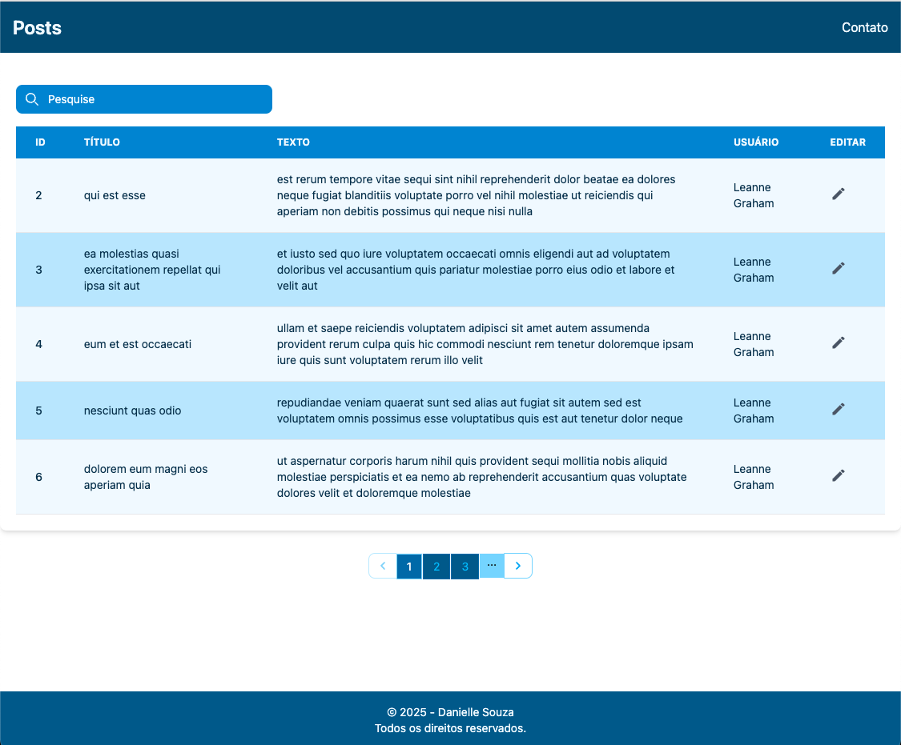

# 📋 Projeto Posts

Este é um projeto front-end desenvolvido com React, que simula uma interface com uma lista de postagens. A estilização é feita com Tailwind CSS, enquanto os testes de componentes são executados com o Vitest. A integração contínua é realizada por meio do GitHub Actions, que executa um job automatizado para verificar se todos os testes estão passando a cada novo push na branch principal (main) — e, em seguida, realiza o deploy no ambiente de produção na Vercel.

# Tela



## 🔥 Funcionalidades

- 📋 Tabela exibindo a lista de posts (API real)
- ✏️ Edição inline de um item na tabela

## 🛠️ Tecnologias e Ferramentas

- [React](https://reactjs.org/)
- [Vitest](https://vitest.dev/)
- [React Router](https://reactrouter.com/)
- [Vercel](https://vercel.com/) (deploy automático)

## 📦 Instalação e uso

Clone o projeto e instale as dependências:

```bash

git clone https://github.com/Danielleelara/jsonplaceholder
cd jsonplaceholder
yarn install

Para iniciar o projeto localmente:
yarn start
Acesse em: http://localhost:5173

🧪 Testes
Para executar os testes unitários:

yarn test
Os testes cobrem os componentes de forma unitária, garantindo estão sendo renderizados corretamente.

🚀 Deploy
O deploy é feito automaticamente na Vercel toda vez que há um push na branch main. O pipeline está configurado para:

- Rodar os testes com o Vitest.

- Se os testes passarem, gerar o build.

- Publicar na Vercel.

Acesse o ambiente de produção em: (https://jsonplaceholder-danielleelaras-projects.vercel.app/)

🧾 Estrutura de Pastas

src/
├── assets/              # Ícones e imagens reutilizáveis
├── components/          # Componentes reutilizáveis (Footer, Loading, NavBar, Pagination, Table)
│   └── __tests__/       # Testes unitários dos componentes
└── pages/               # Páginas da aplicação (ex: Home)


👩‍💻 Autora

Desenvolvido por Danielle Souza